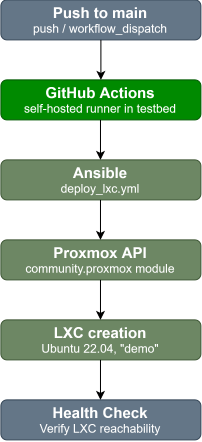

# Dynamic Proxmox LXC Deployment

Automated GitOps-style deployment of a 3-node LXC cluster on a local Proxmox host using Infrastructure as Code. This repository serves as a sandbox to evaluate reproducible infrastructure provisioning on the testbed originally built for my [Self-Healing Network](https://github.com/SchneiderValentin/self-healing-network) project.

**Security Note:** The pipeline only triggers on `push` to `main` and manual `workflow dispatch`. No `pull_request` trigger should be used, since the self-hosted runner has access to actual testbed infrastructure.

## Workflow

  

 

* **Trigger:** `push` to `main` or `workflow_dispatch`. 
* **CD:** Executed via self-hosted GitHub Actions runner.
* **IaC:** Automates dependency setup and executes the `deploy_lxc.yml` Ansible playbook.
* **Provisioning:** Interacts with the Proxmox API via the `community.proxmox` module to create and start the containers.
* **Health Check:** Verifies SSH connectivity to deployed nodes.

## Prerequisites

The following repository secrets are required:
* `PROXMOX_API_PASSWORD`
* `LXC_ROOT_PASSWORD`